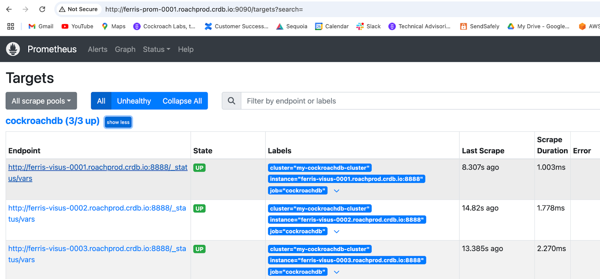
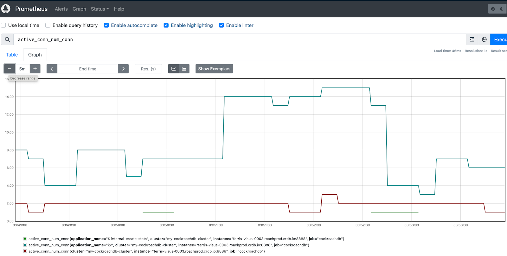

# visus-quickstart
[Visus](https://github.com/cockroachlabs/visus) is a tool created by [Cockroach Labs](https://cockroachlabs.com/) Field Engineering team to allow the creation of custom metrics and expose them to a [Prometheus](https://prometheus.io/) instance.  User can turn custom SQL queries that they have created over the CRDB system and internal tables into Prometheus metrics to monitor specific behaviors not available with CRDB’s canned Prometheus metrics.  Further, metrics can be created that are more granular, such as at the database or application level. The purpose of this repository is to get started using Visus quickly

## Prerequisites:
As a first step, it's strongly recommended that you setup your Prometheus instance using the [Monitor CockroachDB with Prometheus](https://www.cockroachlabs.com/docs/stable/monitor-cockroachdb-with-prometheus) guide. It will guide you through the setting up of the basic Prometheus integration with CRDB and provide you with some baseline metrics to get started monitoring CRDB through Prometheus

## Getting Started:

There are two ways to deploy Visus on CRDB clusters:

[Self Hosted Traditional](#self-hosted-traditional)

[Self Hosted Kubernetes](#self-hosted-kubernetes)   


## Self Hosted Traditional
The steps to install, configure and start Visus on a non-Kubernetes CRDB deployment are straightforward.
- Deploy a CRDB cluster using your normal/preferred deployment process or tooling.
- [Monitor CockroachDB with Prometheus](https://www.cockroachlabs.com/docs/stable/monitor-cockroachdb-with-prometheus)
- Install the Visus executable on each node in the CRDB cluster to run as a sidecar process.
- Initialize the Visus database on one of the Visus nodes via `visus init`
- Start the Visus process on each node. `visus start`
- Load Visus metric profiles to the cluster. `visus collection put -o yaml < query_count.yaml`
- Configure your Prometheus instance to scrape the Visus endpoint. 

__This link is a roachprod script to deploy a CRDB cluster in GCP, configure a Prometheus VM in the same GCP region and apply the necessary prometheus configuration file to scrape the Visus endpoint.  I have used this script to deploy Visus demos for customers and to show customers the components and steps needed to deploy Visus.__

Once Prometheus is configured and started on the standalone VM point your browser to port 9090 on the public/external address of the VM.  The Prometheus UI will be displayed.  Click on Status and select Targets.  This will show you Visus instances that are reporting metrics.  



With healthy Prometheus targets and a by loading the following Visus collection on each node by 
```
name: active_conn
enabled: true
scope: cluster
frequency: 15
maxresults: 50
labels: [application_name]
metrics:
  - name : num_conn
    kind : gauge
    help : number of conns per applications
query:
  SELECT
      application_name::string,
      count(*)::float as num_conn
  FROM
      crdb_internal.cluster_sessions
  WHERE
      active_queries <> ''
  GROUP BY
      1
  ORDER BY
      2 DESC
  LIMIT
      $1;
```

We can view active connections by application name and the output in Prometheus looks like the following



## Self Hosted Kubernetes   
If you don’t have a deployment of CRDB running on Kubernetes, follow the helm instructions [here](https://www.cockroachlabs.com/docs/stable/deploy-cockroachdb-with-kubernetes?filters=helm). In a Kubernetes deployment, an instance of Visus needs to run adjacent to each CRDB pod.  This can be accomplished in Kubernetes by running Visus as a sidecar process on each CRDB node. This can be enabled with the functionality that was enabled via the [Visus sidecar config pull request.](https://github.com/cockroachdb/helm-charts/pull/507).

You can deploy the Visus sidecars along side the CRDB nodes with the following command on installation:
```
helm install my-release cockroachdb/cockroachdb --set visus.enabled=true --set visus.insecure=false
```

Alternatively, you can update an existing helm installation:
Once you have deployed CRDB, verify the CRDB pods are in a ready status.
```
> kubectl get pods
NAME                                READY   STATUS      RESTARTS   AGE
my-release-cockroachdb-0            1/1     Running     0          3m4s
my-release-cockroachdb-1            1/1     Running     0          3m32s
my-release-cockroachdb-2            1/1     Running     0          4m13s
my-release-cockroachdb-init-5dp5n   0/1     Completed   0          4m13s
```
You can then upgrade the package to enable visus.
```
helm upgrade my-release cockroachdb/cockroachdb --set visus.enabled=true --set visus.insecure=false
```
The sidecars are now resident in the pods:
```
> kubectl get pods
NAME                                READY   STATUS      RESTARTS   AGE
my-release-cockroachdb-0            2/2     Running     0          77s
my-release-cockroachdb-1            2/2     Running     0          103s
my-release-cockroachdb-2            2/2     Running     0          2m23s
my-release-cockroachdb-init-l6lkt   0/1     Completed   0          2m26s
```

With the Visus pods running we can now initialize and load metric configurations.  This presents a bit of a challenge because the Visus docker image is not built on a base image that contains bash or any other command line tooling.  All Visus commands must be executed as kubectl commands instead of using kubectl to exec into the Visus pods and issue “normal” linux commands.

To initialize Visus run the following commands on one of the nodes, this will create the initial `_visus` database.
```
> kubectl exec -it my-release-cockroachdb-0  -c visus -- visus \
      init \
      --url \
      "postgres://root@localhost:26257/defaultdb?application_name=visus&sslmode=require&ssrootcert=/cockroach/client/ca.crt&sslcert=/cockroach/client/client.root.crt&sslkey=/cockroach/client/client.root.key"
Database initialized at postgres://root@localhost:26257/defaultdb?application_name=visus&sslmode=require&ssrootcert=/cockroach/client/ca.crt&sslcert=/cockroach/client/client.root.crt&sslkey=/cockroach/client/client.root.key

```

[Start a CRDB command line SQL session](https://www.cockroachlabs.com/docs/stable/deploy-cockroachdb-with-kubernetes?filters=helm#step-3-use-the-built-in-sql-client) to verify the `_visus` database and tables were created.
```
> kubectl exec -it cockroachdb-client-secure -- ./cockroach sql --certs-dir=./cockroach-certs --host=my-release-cockroachdb-public
#
# Welcome to the CockroachDB SQL shell.
# All statements must be terminated by a semicolon.
# To exit, type: \q.
#
# Server version: CockroachDB CCL v25.2.1 (x86_64-pc-linux-gnu, built 2025/06/02 23:17:23, go1.23.7 X:nocoverageredesign) (same version as client)
# Cluster ID: 7c57f963-01d0-475d-8a18-c03d67b431d9
#
# Enter \? for a brief introduction.
#
root@my-release-cockroachdb-public:26257/defaultdb> show databases;
  database_name | owner | primary_region | secondary_region | regions | survival_goal
----------------+-------+----------------+------------------+---------+----------------
  _visus        | root  | NULL           | NULL             | {}      | NULL
  defaultdb     | root  | NULL           | NULL             | {}      | NULL
  postgres      | root  | NULL           | NULL             | {}      | NULL
  system        | node  | NULL           | NULL             | {}      | NULL
(4 rows)

Time: 8ms total (execution 7ms / network 1ms)
```

Next we need to load some metric queries we'd like to collect into Visus.
To load the metric configuration (collection) contained in the query_count.yaml file with definition found here, use the following command
```
for CRDB_NODE in $(kubectl get pods -o json | jq -r '.items[] | select(.metadata.name | test("^my-release-cockroachdb-[0-9]")) | .metadata.name')
do
    kubectl exec -it $CRDB_NODE -c visus  -- visus \
        --url "postgres://root@localhost:26257/defaultdb?application_name=visus&sslmode=require&ssrootcert=/cockroach/client/ca.crt&sslcert=/cockroach/client/client.root.crt&sslkey=/cockroach/client/client.root.key" \
        collection put --yaml - < query_count.yaml
    done
```

To test metric configuration (collection) that you just inserted is valid, use the following command
```
for CRDB_NODE in $(kubectl get pods -o json | jq -r '.items[] | select(.metadata.name | test("^my-release-cockroachdb-[0-9]")) | .metadata.name')
do
    echo 📈Testing node $CRDB_NODE metrics📈
    kubectl exec -it $CRDB_NODE -c visus  -- visus \
        --url "postgres://root@localhost:26257/defaultdb?application_name=visus&sslmode=require&ssrootcert=/cockroach/client/ca.crt&sslcert=/cockroach/client/client.root.crt&sslkey=/cockroach/client/client.root.key" \
        collection test query_count --count 2
    echo 📈Testing Complete📈
done

```

Which gives the following output showing that Visus is setup and configured correctly on Kubernetes.
```
> ./test_metrics.sh
📈Testing node my-release-cockroachdb-0 metrics📈

---- 06-25-2025 17:57:08 query_count -----
# HELP query_count_exec_count statement count per application and database.
# TYPE query_count_exec_count counter
query_count_exec_count{application="visus",database="defaultdb"} 17

---- 06-25-2025 17:57:18 query_count -----
# HELP query_count_exec_count statement count per application and database.
# TYPE query_count_exec_count counter
query_count_exec_count{application="visus",database="defaultdb"} 18
📈Testing Complete📈
📈Testing node my-release-cockroachdb-1 metrics📈

---- 06-25-2025 17:57:19 query_count -----
# HELP query_count_exec_count statement count per application and database.
# TYPE query_count_exec_count counter
query_count_exec_count{application="visus",database="defaultdb"} 21

---- 06-25-2025 17:57:29 query_count -----
# HELP query_count_exec_count statement count per application and database.
# TYPE query_count_exec_count counter
query_count_exec_count{application="visus",database="defaultdb"} 22
📈Testing Complete📈
📈Testing node my-release-cockroachdb-2 metrics📈

---- 06-25-2025 17:57:30 query_count -----
# HELP query_count_exec_count statement count per application and database.
# TYPE query_count_exec_count counter
query_count_exec_count{application="visus",database="defaultdb"} 3

---- 06-25-2025 17:57:40 query_count -----
# HELP query_count_exec_count statement count per application and database.
# TYPE query_count_exec_count counter
query_count_exec_count{application="visus",database="defaultdb"} 4
📈Testing Complete📈
```

Install helm
```
brew install helm

helm repo add prometheus-community https://prometheus-community.github.io/helm-charts
helm search repo prometheus-community
helm install prometheus prometheus-community/prometheus

kubectl port-forward service/prometheus-server 9090:80
```
